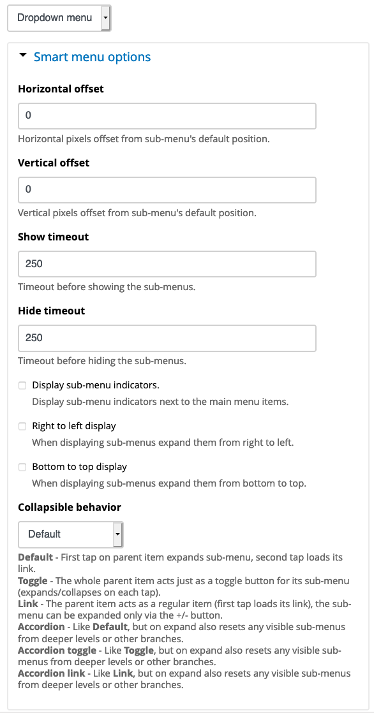

Smart Menu Options
==================

The module introduces new menu configuration options if the dropdown menu style is selected.

You can now control horizontal and vertical offsets of the dropdown menu layer, show and hide
timeouts, show and hide sub-menu indicators, configure your menu's dropdown to expand from
right to left and from bottom to top, and also to choose alternative collapsible behaviour:
Default, Toggle, Link, Accordion, Accordion  toggle and Accordion link.

Installation
------------

- Install this module using the official Backdrop CMS instructions at
  https://backdropcms.org/guide/modules.

- Got to Structure > Layouts > choose layout > Manage Blocks > choose menu block
  and provided the `Dropdown menu` style is selected, you will see the new
  `Smart menu options` settings shown on the above screenshot.

- Set new options as you like and test your Bakcdrop website's dropdown menu.

Issues
------

Bugs and Feature requests should be reported in the Issue Queue:
https://github.com/backdrop-contrib/smart_menu/issues.

Current Maintainers
-------------------

- [Alan Mels](https://github.com/alanmels).
- Seeking additional maintainers.

Credits
-------

- Created for Backdrop CMS by [Alan Mels](https://github.com/alanmels).
- Sponsored by [AltaGrade](https://www.altagrade.com)

License
-------

This project is GPL v2 software.
See the LICENSE.txt file in this directory for complete text.

